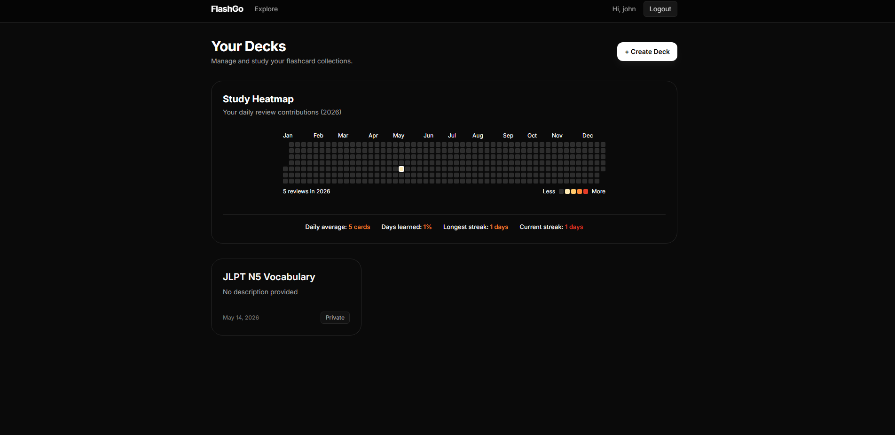
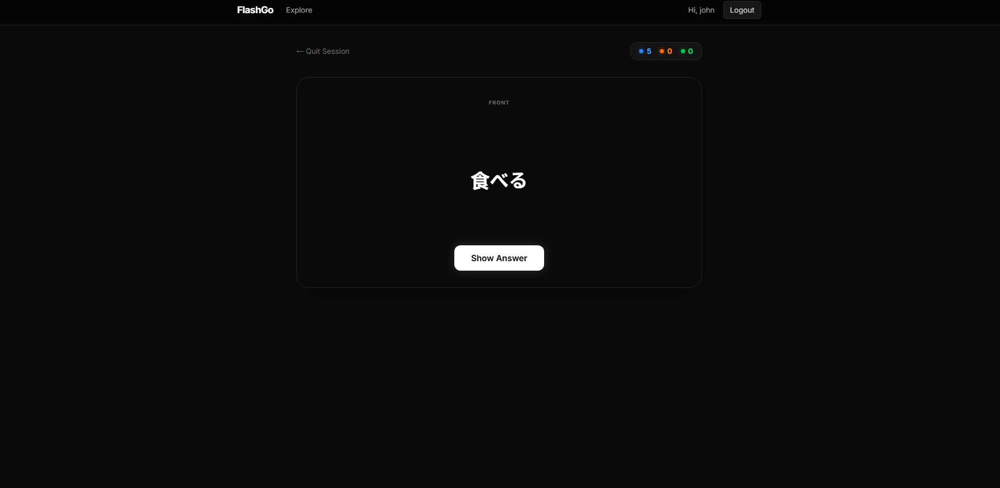
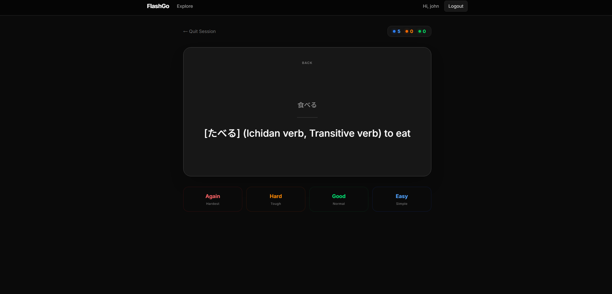
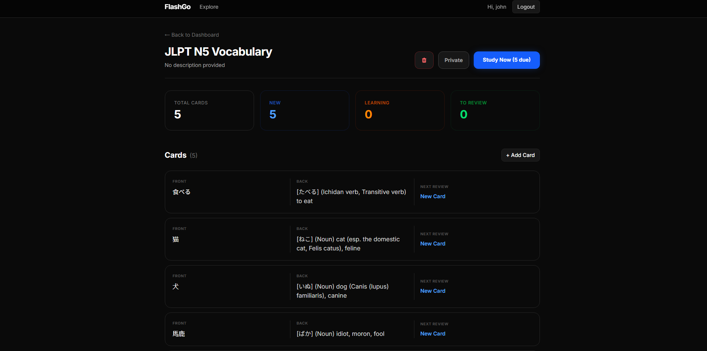
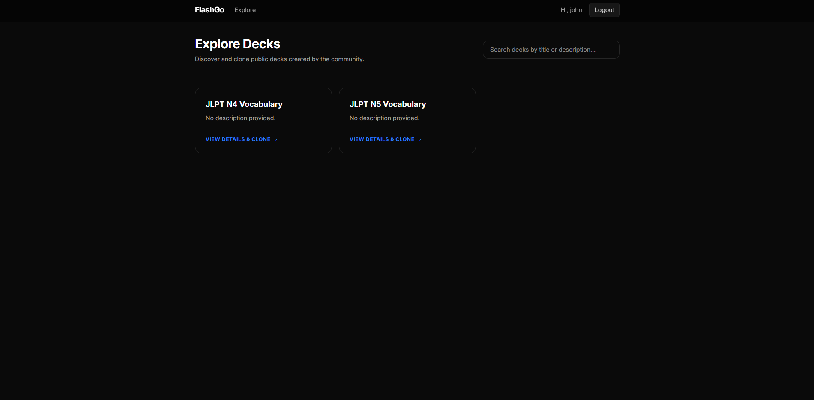
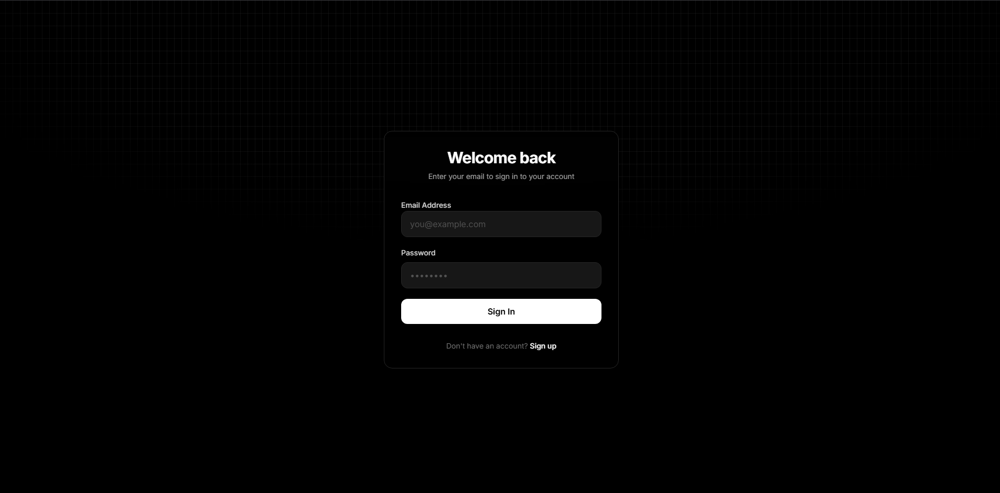

# FlashGo

A full-stack spaced-repetition flashcard application built with Go and React. FlashGo implements the [FSRS (Free Spaced Repetition Scheduler)](https://github.com/open-spaced-repetition/go-fsrs) algorithm — the same scheduling engine behind Anki's latest versions — to determine optimal review intervals for each card. Users create decks, add cards manually or via Jisho dictionary lookup (for Japanese vocabulary), study with scientifically-timed reviews, and track their learning progress through a GitHub-style activity heatmap.

The application also supports a community-driven deck ecosystem: users can publish decks publicly, and others can browse, preview, and fork them into their own libraries. The backend follows a clean, layered architecture (handler → service → repository) with JWT-based authentication and ownership-scoped authorization on every resource.



---

## Tech Stack

| Layer        | Technology           | Purpose                                        |
| ------------ | -------------------- | ---------------------------------------------- |
| Frontend     | React 19, TypeScript | UI framework and type safety                   |
| Styling      | Tailwind CSS 4       | Utility-first component styling                |
| Routing      | React Router 7       | Client-side navigation and protected routes    |
| Server State | TanStack Query 5     | Data fetching, caching, and cache invalidation |
| Client State | Zustand 5            | Auth persistence and study session state       |
| HTTP Client  | Axios                | API communication with interceptors            |
| Backend      | Go 1.25, Gin         | REST API server and routing                    |
| Database     | PostgreSQL 15        | Persistent storage (via Docker)                |
| Auth         | JWT + bcrypt         | Stateless authentication with hashed passwords |
| Scheduling   | go-fsrs              | FSRS spaced-repetition algorithm               |
| Dictionary   | Jisho API            | Japanese word lookup for auto-card generation  |

---

## Key Features

### FSRS Spaced Repetition

Every card in FlashGo carries a full set of FSRS scheduling parameters — stability, difficulty, elapsed days, scheduled days, reps, and lapses — that are recalculated on each review using the `go-fsrs` library on the server side. When a user reviews a card, they assign one of four ratings, and the algorithm computes the next optimal review date accordingly.

| Rating | Label | Behavior                                            |
| ------ | ----- | --------------------------------------------------- |
| 1      | Again | Card is re-queued at the end of the current session |
| 2      | Hard  | Short interval; difficulty increases                |
| 3      | Good  | Standard interval based on current stability        |
| 4      | Easy  | Longest interval; stability grows rapidly           |

Cards progress through four states during their lifecycle:

| State      | Value | Meaning                                                  |
| ---------- | ----- | -------------------------------------------------------- |
| New        | 0     | Never reviewed; due immediately                          |
| Learning   | 1     | Recently introduced; short review intervals              |
| Review     | 2     | Graduated to longer intervals                            |
| Relearning | 3     | Previously known but lapsed; re-entering short intervals |

The frontend's `useStudyStore` manages the session queue locally. When a card receives an "Again" rating (1), it is appended to the end of the queue so the user sees it again before the session ends. All other ratings advance to the next card.





### Deck Management

Each user has a private library of decks. A deck has a title, description, and a public/private visibility toggle. The deck detail view shows per-deck statistics fetched from the server:

| Statistic      | Description                                   |
| -------------- | --------------------------------------------- |
| Total Cards    | All cards in the deck                         |
| Due Today      | Cards with a due date at or before now        |
| New Cards      | Cards in state 0 (never reviewed)             |
| Learning Cards | Cards in state 1 (active learning)            |
| Review Cards   | Cards in state 2 (graduated, periodic review) |

Cards can be created manually (front/back text) or via the auto-generation feature. Existing cards can be edited inline through a modal interface.



### Auto-Card Generation via Jisho API

The "Auto Add" feature lets users type a Japanese word, and the server queries the [Jisho.org API](https://jisho.org) to fetch the kanji form, reading, part of speech, and English definitions. The server assembles these into a structured card:

- **Front**: The kanji form of the word (or the input if no kanji exists)
- **Back**: `[reading] (part of speech) definition1, definition2, ...`

This eliminates the tedium of manually creating Japanese vocabulary cards and ensures consistent formatting across the deck.


### Explore and Fork

Any user can toggle a deck to public, making it visible on the Explore page. The Explore page provides paginated browsing with text search across titles and descriptions. Visitors can preview all cards in a public deck (in read-only mode) and fork the entire deck into their own library with a single click. Forking creates an independent copy — the new owner's cards start fresh with default FSRS parameters.



### Study Activity Heatmap

The dashboard features a GitHub-style contribution heatmap that visualizes review activity over time. Each cell represents a day, colored by the number of reviews completed. The data is pulled from the `card_reviews` table, aggregated by date on the server, and rendered on the client using `react-activity-calendar`.


### Authentication and Authorization

User registration hashes passwords with bcrypt before storage. Login returns a JWT set as an HTTP-only cookie (with a fallback to `Authorization: Bearer` header). The `RequireAuth` middleware extracts and verifies the JWT on every protected route, injecting the `userID` into the Gin context. Every service-layer operation then checks that the requesting user owns the target resource (deck or card) before proceeding — there is no admin role, just strict per-user ownership scoping.



---

## Architecture and Data Flow

```
┌─────────────────────────────────────────────────────────────────────┐
│  BROWSER (React + TypeScript)                                       │
│                                                                     │
│  ┌──────────┐   ┌──────────────┐   ┌────────────┐   ┌───────────┐   │
│  │ Zustand  │   │ TanStack     │   │ Axios      │   │ React     │   │
│  │ (Auth,   │◄──│ Query        │◄──│ Client     │──►│ Router    │   │
│  │  Study)  │   │ (Cache)      │   │ (Intercept)│   │ (Guards)  │   │
│  └──────────┘   └──────┬───────┘   └─────┬──────┘   └───────────┘   │
│                        │                 │                          │
└────────────────────────┼─────────────────┼──────────────────────────┘
                         │  HTTP/JSON      │
                         ▼                 ▼
┌─────────────────────────────────────────────────────────────────────┐
│  SERVER (Go + Gin)                                                  │
│                                                                     │
│  ┌──────────┐   ┌──────────────┐   ┌────────────┐   ┌───────────┐   │
│  │ Router   │──►│ Middleware   │──►│ Handlers   │──►│ Services  │   │
│  │ (CORS)   │   │ (JWT Auth)   │   │ (Validate) │   │ (Logic)   │   │
│  └──────────┘   └──────────────┘   └────────────┘   └─────┬─────┘   │
│                                                           │         │
│                                    ┌───────────────┐      │         │
│                                    │ Repositories  │◄─────┘         │
│                                    │ (SQL Queries) │                │
│                                    └───────┬───────┘                │
└────────────────────────────────────────────┼────────────────────────┘
                                             │
                                             ▼
                                    ┌────────────────┐
                                    │  PostgreSQL 15 │
                                    │  (Docker)      │
                                    └────────────────┘
```

A request flows through the system as follows. The React frontend issues an HTTP call via an Axios instance configured with the API base URL and credential forwarding. TanStack Query manages caching and automatic refetching — mutations invalidate related query keys so the UI stays consistent without manual refreshes. On the server, Gin's router dispatches the request through the CORS and JWT middleware, then to the appropriate handler. The handler validates input and delegates to a service, which contains the business logic (FSRS scheduling, Jisho lookup, ownership checks). The service calls repository methods that execute raw SQL against PostgreSQL. Responses flow back as JSON.

Two Zustand stores manage client-side concerns independently of server state: `useAuthStore` (persisted to localStorage) tracks login status, and `useStudyStore` (ephemeral) manages the card queue, flip state, and session progress during a study session.

---

## Database Schema

| Table            | Column           | Type              | Description                               |
| ---------------- | ---------------- | ----------------- | ----------------------------------------- |
| **users**        | `id`             | UUID (PK)         | Auto-generated user identifier            |
|                  | `username`       | VARCHAR(255)      | Unique display name                       |
|                  | `email`          | VARCHAR(255)      | Unique login credential                   |
|                  | `password_hash`  | VARCHAR(255)      | bcrypt-hashed password                    |
|                  | `created_at`     | TIMESTAMPTZ       | Registration timestamp                    |
| **decks**        | `id`             | UUID (PK)         | Deck identifier                           |
|                  | `user_id`        | UUID (FK → users) | Owner; cascades on delete                 |
|                  | `title`          | VARCHAR(255)      | Deck name                                 |
|                  | `description`    | TEXT              | Optional deck description                 |
|                  | `is_public`      | BOOLEAN           | Visibility on the Explore page            |
|                  | `created_at`     | TIMESTAMPTZ       | Creation timestamp                        |
| **cards**        | `id`             | UUID (PK)         | Card identifier                           |
|                  | `deck_id`        | UUID (FK → decks) | Parent deck; cascades on delete           |
|                  | `front`          | TEXT              | Question / prompt side                    |
|                  | `back`           | TEXT              | Answer side                               |
|                  | `due`            | TIMESTAMPTZ       | Next scheduled review date                |
|                  | `stability`      | FLOAT8            | FSRS stability parameter                  |
|                  | `difficulty`     | FLOAT8            | FSRS difficulty parameter                 |
|                  | `elapsed_days`   | INT8              | Days since last review                    |
|                  | `scheduled_days` | INT8              | Days until next review                    |
|                  | `reps`           | INT8              | Total successful repetitions              |
|                  | `lapses`         | INT8              | Times the card was forgotten              |
|                  | `state`          | INT2              | 0=New, 1=Learning, 2=Review, 3=Relearning |
|                  | `last_review`    | TIMESTAMPTZ       | Timestamp of most recent review           |
|                  | `created_at`     | TIMESTAMPTZ       | Creation timestamp                        |
| **card_reviews** | `id`             | UUID (PK)         | Review log entry                          |
|                  | `card_id`        | UUID (FK → cards) | Reviewed card; cascades on delete         |
|                  | `user_id`        | UUID (FK → users) | Reviewer; cascades on delete              |
|                  | `rating`         | INT2              | 1=Again, 2=Hard, 3=Good, 4=Easy           |
|                  | `scheduled_days` | INT8              | Scheduled interval at time of review      |
|                  | `elapsed_days`   | INT8              | Elapsed interval at time of review        |
|                  | `state`          | INT2              | Card state after review                   |
|                  | `reviewed_at`    | TIMESTAMPTZ       | When the review occurred                  |

---

## Local Setup

### Prerequisites

- [Go 1.25+](https://go.dev/dl/)
- [Node.js 20+](https://nodejs.org/) with npm
- [Docker](https://www.docker.com/) (for PostgreSQL)

### 1. Clone the repository

```bash
git clone https://github.com/Enjoyer123/flashCard-go.git
cd flashCard-go
```

### 2. Start the database

```bash
cd server
docker compose up -d
```

This spins up a PostgreSQL 15 Alpine container on port 5432 and runs `init.sql` to create the schema automatically.

### 3. Configure environment variables

**Server** (`server/.env`):

| Variable      | Example           | Description         |
| ------------- | ----------------- | ------------------- |
| `DB_USER`     | `admin`           | PostgreSQL username |
| `DB_PASSWORD` | `password`        | PostgreSQL password |
| `DB_HOST`     | `localhost`       | Database host       |
| `DB_PORT`     | `5432`            | Database port       |
| `DB_NAME`     | `flashcard_db`    | Database name       |
| `secretKey`   | `your-jwt-secret` | JWT signing key     |

**Client** (`client/.env`):

| Variable       | Example                 | Description          |
| -------------- | ----------------------- | -------------------- |
| `VITE_API_URL` | `http://localhost:8080` | Backend API base URL |

### 4. Run the backend

```bash
cd server
go run cmd/main.go
```

The API server starts on `http://localhost:8080`. Verify with `GET /ping`.

### 5. Run the frontend

```bash
cd client
npm install
npm run dev
```

The dev server starts on `http://localhost:5173`.

---

## Project Structure

```
flashCard-go/
├── client/                          # React frontend
│   ├── src/
│   │   ├── api/                     # Axios API functions
│   │   │   ├── client.ts            # Axios instance + interceptors
│   │   │   ├── authApi.ts           # Login, register, logout
│   │   │   ├── cardApi.ts           # Card CRUD, review, auto-add
│   │   │   └── deckApi.ts           # Deck CRUD, fork, public search
│   │   ├── components/              # Shared UI components
│   │   │   ├── CardList.tsx         # Card grid with edit/preview modes
│   │   │   ├── DeckCard.tsx         # Deck card (dashboard + explore variants)
│   │   │   └── ProtectedRoute.tsx   # Auth guard wrapper
│   │   ├── hooks/queries/           # TanStack Query hooks
│   │   │   ├── useCards.ts          # useCreateCard, useDueCards, useReviewCard, etc.
│   │   │   └── useDecks.ts          # useDecks, useDeck, useForkDeck, etc.
│   │   ├── layouts/
│   │   │   └── MainLayout.tsx       # Nav bar + outlet
│   │   ├── pages/
│   │   │   ├── auth/                # Login, Register
│   │   │   ├── dashboard/           # Dashboard, StudyHeatmap, CreateDeckModal
│   │   │   ├── decks/               # DeckDetail, DeckHeader, DeckStatsGrid, AddCardModal
│   │   │   ├── explore/             # Explore (search + paginate), ExploreDetail (preview + fork)
│   │   │   └── study/               # StudyMode, Flashcard, RatingControls, StudyProgress
│   │   ├── store/                   # Zustand stores
│   │   │   ├── useAuthStore.ts      # Persisted auth state
│   │   │   └── useStudyStore.ts     # Ephemeral study session state
│   │   ├── types/                   # TypeScript interfaces
│   │   └── App.tsx                  # Route definitions
│   ├── .env                         # VITE_API_URL
│   ├── package.json
│   └── vite.config.ts
│
├── server/                          # Go backend
│   ├── cmd/
│   │   └── main.go                  # Entrypoint: wires all layers
│   ├── db/
│   │   └── db.go                    # PostgreSQL connection
│   ├── internal/
│   │   ├── card/                    # Card domain (model, handler, service, repository)
│   │   ├── deck/                    # Deck domain (model, handler, service, repository)
│   │   ├── health/                  # Health check endpoint
│   │   ├── model/                   # Shared models (JWT claims)
│   │   └── user/                    # User domain (model, handler, service, repository)
│   ├── middleware/
│   │   └── auth.go                  # JWT cookie/bearer verification
│   ├── router/
│   │   └── router.go                # Route registration + CORS config
│   ├── util/                        # Helpers (password hashing, JWT, context)
│   ├── init.sql                     # Database schema DDL
│   ├── docker-compose.yml           # PostgreSQL container
│   ├── .env                         # DB credentials + JWT secret
│   └── go.mod
```

---

## API Reference

### Public Routes

| Method | Endpoint         | Description                                            |
| ------ | ---------------- | ------------------------------------------------------ |
| `GET`  | `/ping`          | Health check                                           |
| `POST` | `/auth/register` | Create a new account                                   |
| `POST` | `/auth/login`    | Authenticate and receive JWT                           |
| `POST` | `/auth/logout`   | Clear session                                          |
| `GET`  | `/decks/public`  | Search public decks (query: `search`, `page`, `limit`) |

### Protected Routes (require JWT)

| Method   | Endpoint                   | Description                                          |
| -------- | -------------------------- | ---------------------------------------------------- |
| `POST`   | `/decks`                   | Create a deck                                        |
| `GET`    | `/decks`                   | List current user's decks                            |
| `GET`    | `/decks/:id`               | Get deck with all cards                              |
| `PATCH`  | `/decks/:id`               | Update deck title, description, visibility           |
| `DELETE` | `/decks/:id`               | Delete a deck and all its cards                      |
| `POST`   | `/decks/:id/cards`         | Add a card to a deck                                 |
| `POST`   | `/decks/:id/fork`          | Fork a public deck into your library                 |
| `GET`    | `/decks/:id/review`        | Get all due cards for a deck                         |
| `GET`    | `/decks/:id/stats`         | Get deck statistics                                  |
| `PATCH`  | `/cards/:id`               | Update a card's front/back text                      |
| `DELETE` | `/cards/:id`               | Delete a card                                        |
| `POST`   | `/cards/:id/review`        | Submit a review rating (triggers FSRS recalculation) |
| `POST`   | `/cards/auto`              | Auto-generate a card from Jisho dictionary           |
| `GET`    | `/users/me/study-activity` | Get review count per day for heatmap                 |

---

## Useful Commands

```bash
# Start PostgreSQL container
cd server && docker compose up -d

# Stop PostgreSQL container
cd server && docker compose down

# Run backend
cd server && go run cmd/main.go

# Run frontend dev server
cd client && npm run dev

# Type-check and build frontend
cd client && npm run build

# Lint frontend
cd client && npm run lint
```

---

## Known Limitations

- The Jisho auto-card feature only uses the first search result and first sense; multi-definition words lose nuance.
- There is no email verification or password reset flow.
- The JWT secret is stored in a plain `.env` file with no rotation mechanism.
- Deck forking copies cards but does not maintain a link to the original — upstream changes are not synced.
- There is no rate limiting on the API.

---

## About

**FlashGo** is a personal side project built to explore Go backend development with a modern React frontend, and to put the FSRS spaced-repetition algorithm into practice with a real, usable application.
